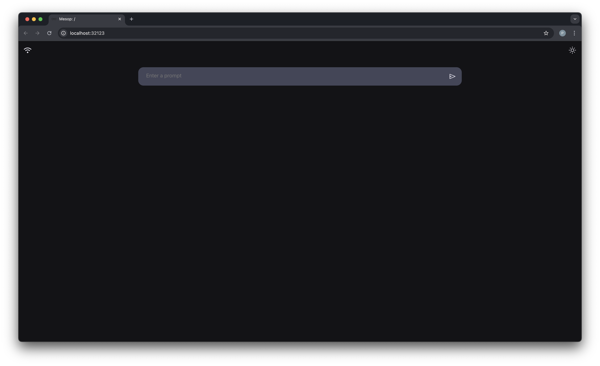

# Airplane Mode Llama3

Simple [mesop](https://google.github.io/mesop/) chat GUI app to run Llama3 blazingly fast in the cloud using [Groq](https://console.groq.com/docs/overview), or locally using Apple's [MLX](https://ml-explore.github.io/mlx/build/html/index.html) framework. As a result, the local Llama3 implementation only runs well on a Mac - but one could easily rewrite the `model.py` file in PyTorch or some other framework (Jax, TensorFlow, etc...).

Both the Llama3 model and tokenizer are implemented from scratch, just for fun and to show what's going on under the hood. As a result, this is probably not the most performant local implementation of Llama3 :).

Also, the `tokenizer.py` file borrows quite a lot from the official tiktoken [`_educational.py`](https://github.com/openai/tiktoken/blob/main/tiktoken/_educational.py) implementation and Andrej Karpathy's minbpe [`regex.py`](https://github.com/karpathy/minbpe/blob/master/minbpe/regex.py) tokenizer. Credit goes to those authors!

## Prerequisites

(Recommended but optional) Create a Python virtual environment and activate it:

```
python3 -m venv venv
source venv/bin/activate
# `deactivate` to deactivate the environment
```

Install Python dependencies:

```
pip install -r requirements.txt
```

Download the Llama3 `tokenizer.model` file from the official [Llama3 reference implementation](https://github.com/meta-llama/llama-models/tree/main/models/llama3) by Meta:

```
wget https://github.com/meta-llama/llama-models/blob/main/models/llama3/api/tokenizer.model
```

Populate the `example.env` file with your Groq API key and then rename the file to `.env`.

## Usage

Run:

```
mesop main.py
```

Then navigate to http://localhost:32123/ in your browser. You should see the following:



Simply type in your prompt and then click the "send" button!

## Default Behavior

By default, the app will use [Groq](https://console.groq.com/docs/overview). To toggle between Groq/local mode, simply click the "wifi" indicator button in the top left corner. You can switch back and forth between Groq/local mode - the chat history gets shared with both.

Also by default, the app will launch in light or dark mode according to your system theme. To toggle this, simply click the light/dark mode button in the top right.